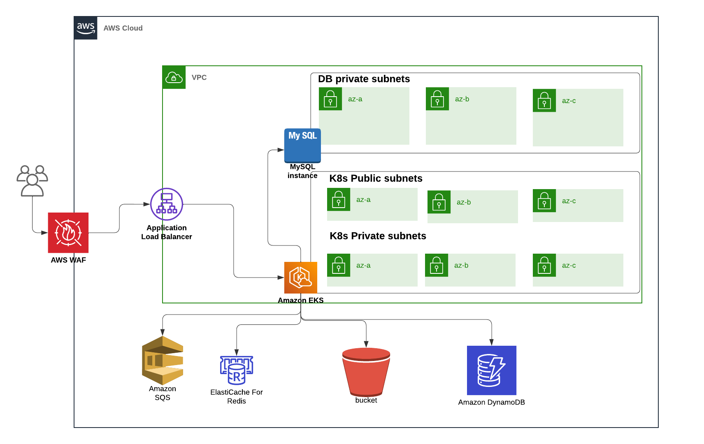

# PHP8 Application
This repo contains php8 application with all the components to automate it's development lifecyle and build the infrastructure in AWS.

## Architecture Design

## Github Workflows

- staging.yaml: build and deploy staging version based on push to master branch.

- on-demand.yaml: build and deploy on-demand dev version based on a word in the PR title 'on-demand'.

- production.yaml: build and deploy production version based on release published.

## Helm Charts

- Helm templates to deploy k8s manifests for dev, staging and production.

## Terraform

- Terraform modules to deploy infrastructure:
    - VPC
    - S3
    - Dynamodb
    - mysql
    - elasticahce
    - eks
    - sqs
    - waf